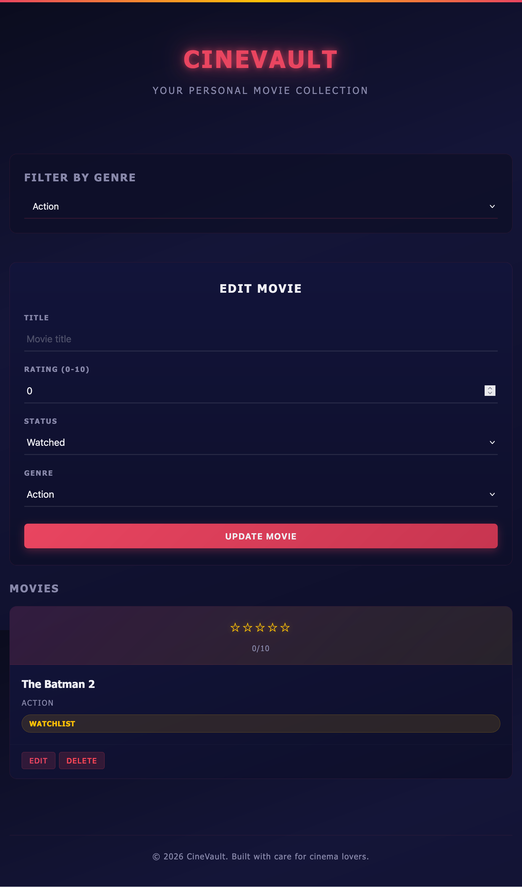
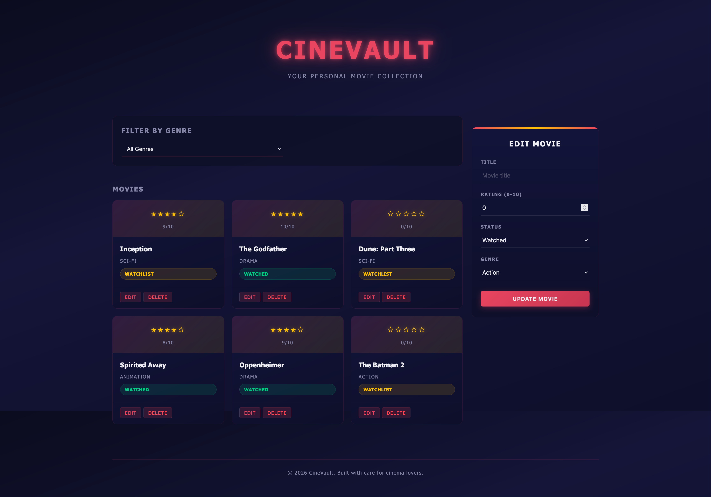
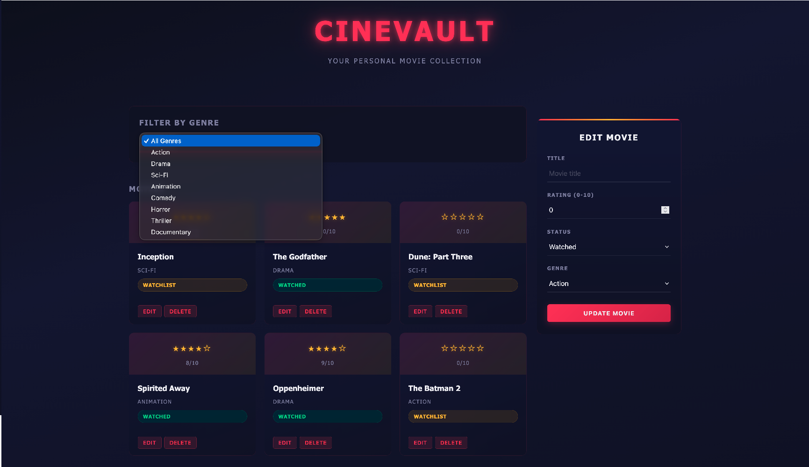
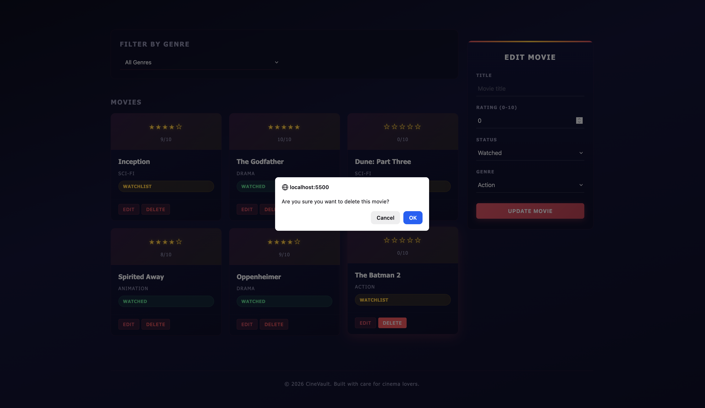
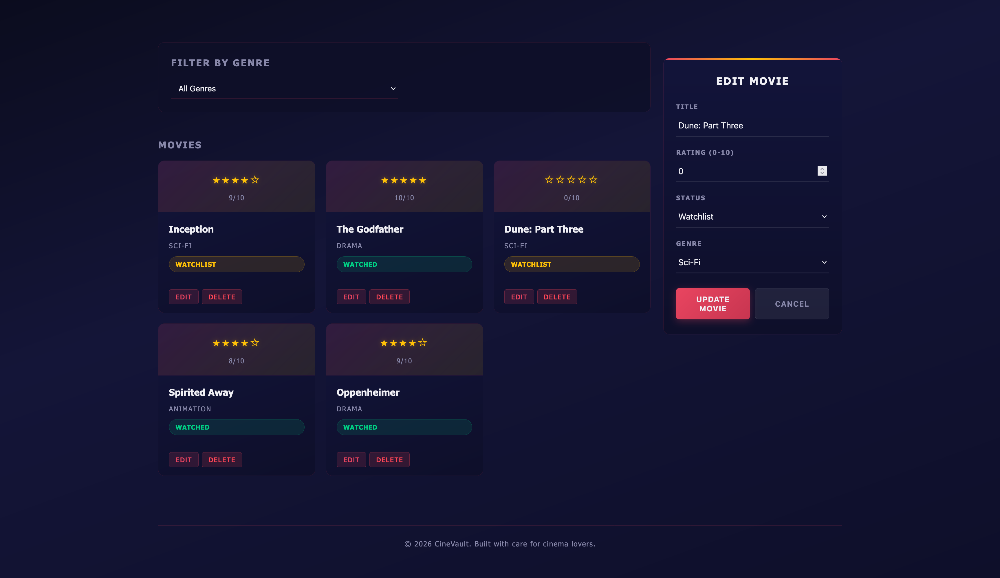

<p align="center">
<strong>Qatar University</strong><br>
College of Engineering - Department of Computer Science and Engineering<br>
<strong>CMPS 350 - Web Development</strong>
</p>

---

# Midterm Exam: Section B01 - Movie Collection

**Duration:** 120 minutes
**Total Marks:** 100

---

## Exam Rules

1. This is an **open-book, individual exam**. You may refer to your notes, lab code, and course materials.
2. **No AI tools** (ChatGPT, GitHub Copilot, Claude, Gemini, etc.) may be used during the exam.
3. **No communication** with other students during the exam.
4. Any use of AI tools or sharing of answers will be treated as an **academic integrity breach** under [Qatar University's Student Code of Conduct](https://www.qu.edu.qa/en-us/students/resources/Pages/code-of-conduct.aspx) and will result in a **zero grade** for the exam.

---

## Instructions

You are provided with an HTML page, a styled CSS file, and a starter JavaScript file. Complete the TODO items to make the application functional.

- **Do not modify the HTML structure.**
- **Do not remove the TODO comments from your code.** Write your solution below each TODO.

---

## API Endpoints

**Base URL:** `https://exam-api-nine.vercel.app`

| Method | Endpoint                | Description                  |
| ------ | ----------------------- | ---------------------------- |
| GET    | `/movies`             | Get all movies               |
| GET    | `/movies?genre=Drama` | Get movies filtered by genre |
| GET    | `/categories/movies`  | Get list of available genres |
| PUT    | `/movies/:id`         | Update a movie               |
| DELETE | `/movies/:id`         | Delete a movie               |
| POST   | `/reset/movies`       | Reset to default data        |

### Data Structure

```json
{
  "id": 1,
  "title": "Inception",
  "rating": 9,
  "status": "watched",
  "genre": "Sci-Fi",
  "date": "2026-03-01"
}
```

---

## TODO Breakdown

| TODO            | Points        | Description                                                         |
| --------------- | ------------- | ------------------------------------------------------------------- |
| 1               | 10            | CSS Grid template areas (desktop two-column + mobile single-column) |
| 2               | 35            | Fetch movies from the API and display them as cards                 |
| 3               | 20            | Populate the genre dropdown from the API and filter movies by genre |
| 4               | 15            | Delete a movie with confirmation                                    |
| 5               | 20            | Edit a movie (populate form + update via PUT)                       |
| **Total** | **100** |                                                                     |

---

## Expected Output

Below are screenshots showing what your app should look like after completing each TODO.

### TODO 1: Desktop Layout (two columns) and Mobile Layout (single column)




### TODO 2: Movies loaded and displayed as cards



### TODO 3: Genre dropdown populated and filtering working



### TODO 4: Delete a movie (confirmation dialog)



### TODO 5: Edit a movie (form populated, updated after submit)



---

## Submission

1. Save your work in `js/app.js` and `css/styles.css`.
2. Push to **your own repo** under `Midterm/` before the exam time ends.

Your folder should look like this:

```
Your Repo /
└── Midterm/
    ├── index.html
    ├── css/
    │   └── styles.css
    └── js/
        └── app.js
```

**Do not push after the exam ends. Late submissions will not be accepted.**

Good luck!
